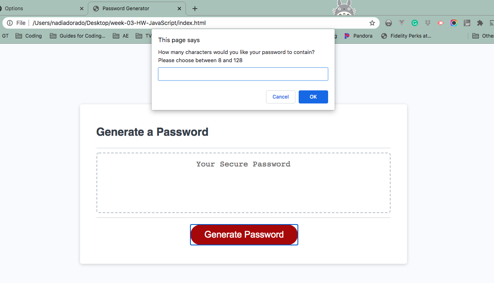
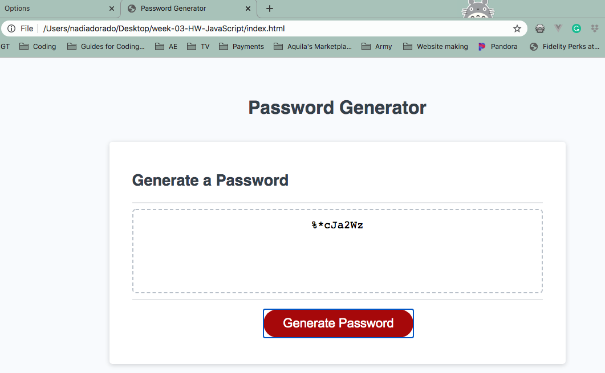
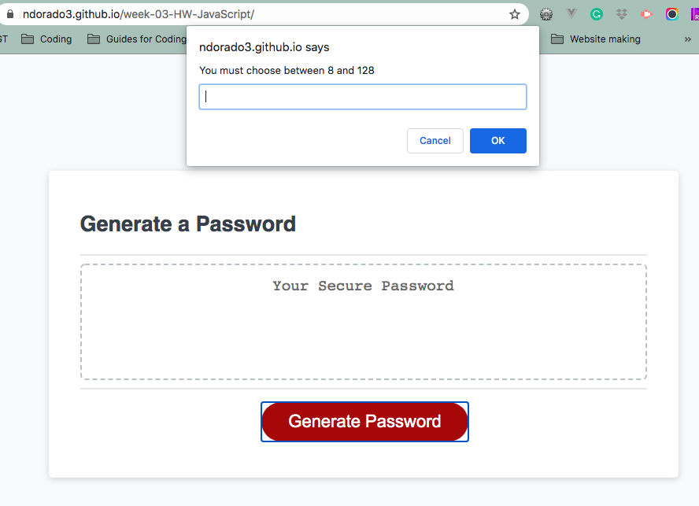

# ScramblePassword Generator

This project is an assigned homework for the Georgia Tech coding Bootcamp. The HTML, CSS, and part of the Javascript code were given. I worked on the function genratePasword’s code.

This application emphasizes the use of Javascript to generate a random password for the user.

The user clicks on the "Generate Password" button in order to display an alert window that presents a series of prompts for password criteria, which a minimum of one needs to be met in order to generate the password succesfully.

### Password Criterias:

1. Required criteria:
   a. Password length: The user must choose a number from 8 - 128.

2. Optional criteria: The user must choose at least one.
   a. Numbers: The user can choose if he/she wants to include numbers in the password.
   b. Special characters: The user can choose if he/she wants to include special characters in the password.
   c. Lower case letters: The user can choose if he/she wants to include lower case letters in the password.
   d. Upper case letters: The user can choose if he/she wants to include upper case letters in the password.

## User Story

```
AS AN employee with access to sensitive data
I WANT to randomly generate a password that meets certain criteria
SO THAT I can create a strong password that provides greater security
```
## How ScramblePassword Generator Works 

The following shows the web application's appearance and functionality:

### Code 

Sript features: 

   1. Variable declaration area.
   2. An event listener (onclick) to generate button.
   3. The function generatePassword:
      - This will prompt the user for input between 8-128.
      - This variable is changed to an integer using ParseInt().
      - The isNaN function only allows numbers as an input. 
      - This will validate that the input is a number within a range, or is a number.
      - This then uses the input to determine the types (or choices) or letters of characters used, using an 
         if statement.
      - A if statement will validate the selected choices.
      - A for loop will loop through the user inputs until it reaches the length # set by the user.
   4. The string value is display in the GUI text area using the writePassword function. 

### GUI Features 

1. Generate button:

   When clicked by the user, it will trigger a series of prompts for password criteria.

2. Window alerts:

   It displays a series of questions for the user on which they can click "OK" or "Cancel" button, to submit their answers.




3.  Textarea:

    This text area will display the generated password that meets all the user's selected criteria.



### Validations

The code is design to validate the user’s answers by doing the following:

  1. Length criteria: 
      If the user inputs a number < 8 or > 128, it will prompt a message indicating the range that the user is allowed to use. Also, if the user inputs anything other than a number, it will get a prompt message indicating that only numbers are valid for this entry. 

  2. Confirm choices: 
      If the user does not choose at least 1 out of the 4 criteria, meaning all the responses are negative, it will prompt a message indicating that he/she needs to at least choose 1. 

 


## Live link

The following is the live link of the application: 

 https://ndorado3.github.io/week-03-HW-JavaScript/


 ## Authors and acknowledment
  - Nadia Dorado - student  
  - GT Bootcamp Project Design Team 